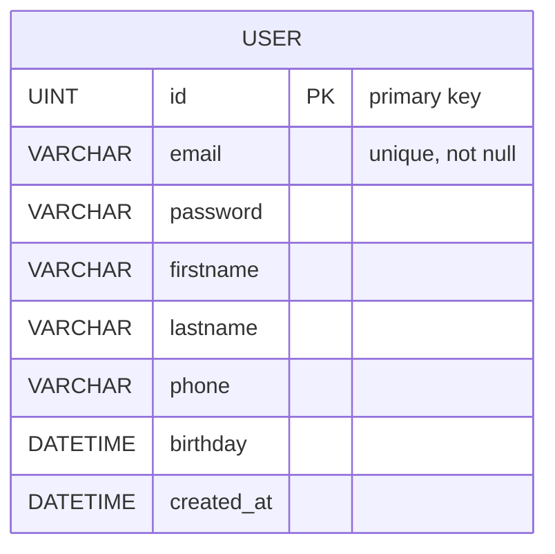

# Database ER Diagram (Mermaid)

แผนภาพ ER แบบ Mermaid อ้างอิงจากโมเดลที่มีในโปรเจค (เฉพาะโมเดลที่เกี่ยวข้องกับฐานข้อมูล)

วิธีดูภาพ:
- ใช้ VS Code extension ที่รองรับ Mermaid หรือ
- เปิดในเว็บที่รองรับ Mermaid (เช่น Mermaid Live Editor) โดยคัดลอกบล็อกโค้ดด้านบนไปวาง

หมายเหตุ: ถ้าคุณเพิ่มโมเดลอื่น ๆ (เช่น Wallet, Transaction, Product) ผมสามารถอัปเดต ER diagram ให้เชื่อมความสัมพันธ์อัตโนมัติได้ตามโค้ด
